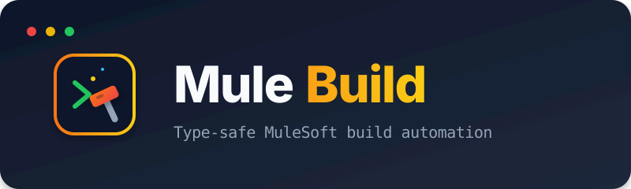

<p align="center">
  
</p>

<p align="center">
  <a href="https://www.npmjs.com/package/@sfdxy/mule-build"></a>
  <a href="https://github.com/Avinava/mule-build/actions"></a>
  <a href="https://github.com/Avinava/mule-build/blob/master/LICENSE"></a>
</p>

<p align="center">
  <strong>Build, validate, release, and locally run Mule 4 applications from one typed CLI, JavaScript API, or MCP server.</strong>
</p>

<p align="center">
  <a href="https://avinava.github.io/mule-build/">Documentation</a> •
  <a href="#install">Install</a> •
  <a href="#commands">Commands</a> •
  <a href="#configuration">Configuration</a> •
  <a href="#mcp-server">MCP</a> •
  <a href="#ecosystem">Ecosystem</a>
</p>

---

No Anypoint credentials are required. Deploying a built artifact and reading runtime evidence are a
different tool's job — see [Ecosystem](#ecosystem).

## Install

```bash
npm install --global @sfdxy/mule-build@2.1.0
mule-build --version
mule-build --help
```

For CI and shared configuration, prefer `npx -y @sfdxy/mule-build@2.1.0 ...` so the executed version
is explicit. Examples below omit the pin for readability; add `@2.1.0` anywhere the version should not
drift.

Requires Node.js `>=20.19.0`, Maven on `PATH`, and a JDK compatible with your Mule runtime. A local
Mule runtime is needed only for `run`, `status`, and `stop`. Full list in
[Prerequisites](https://avinava.github.io/mule-build/prerequisites/).

## Commands

Run from a Mule project root, or pass `-C /path/to/project`.

| Command | Purpose |
| --- | --- |
| `doctor` | Diagnose build, run, or release readiness. Read-only |
| `package` | Build the application. `mvn clean package`, no source rewriting |
| `run` | Build, start a compatible runtime if needed, and deploy |
| `status`, `stop` | Inspect or stop the resolved runtime |
| `enforce` | Fail when sensitive properties omit `secure::` |
| `strip` | Remove `secure::` prefixes from source. Preview with `--dry-run` |
| `release` | Version, tag, and push as one transaction |
| `mcp` | Start the stdio MCP server |

```bash
# Diagnose build readiness (runtime is informational here)
mule-build doctor --operation build

# Safe default build: mvn clean package
mule-build package

# Apply a named mule-build.yaml profile
mule-build package --profile production

# Build from an isolated copy with secure:: removed; source is unchanged
mule-build package --strip-secure

# Build, start a compatible runtime if needed, and deploy
mule-build run --runtime-home /opt/mule-4.10.2

# Inspect or stop the selected runtime
mule-build status --runtime-home /opt/mule-4.10.2
mule-build stop --runtime-home /opt/mule-4.10.2

# Security operations
mule-build enforce
mule-build strip --dry-run

# Preview before mutating POM/git state
mule-build release --bump patch --dry-run
mule-build release --bump patch
```

Every flag is documented in the [CLI reference](https://avinava.github.io/mule-build/cli/).
`package --env` remains a deprecated alias for `--profile`, and a profile name is valid only when it
exists in `mule-build.yaml`, including the built-in `production` default.

## Configuration

Copy [`mule-build.yaml.example`](mule-build.yaml.example) to `mule-build.yaml` in the Mule project
root and edit it. That file is the maintained sample; it ships with the package so it is available
after a global install too.

Unknown configuration keys and unknown profile names fail early rather than being ignored. Runtime
selection precedence:

1. `--runtime-home` / API `runtimeHome`
2. `MULE_HOME`
3. `runtime.home`
4. a compatible runtime under `MULE_RUNTIMES_DIR`, `runtime.searchPaths`, `~/muleRuntimes`,
   `~/AnypointStudio/runtimes`, or the standard macOS Anypoint Studio plugins directory

When `.classpath` declares a Mule runtime, the resolver matches major, minor, and edition. With
`strictVersion: true`, the default, it rejects an incompatible fallback instead of building something
that fails on deployment.

## Secure properties

Normal builds do not rewrite XML. Profiles may select:

- `unchanged`: build source as-is.
- `enforce`: fail if sensitive property references omit `secure::`.
- `strip`: build an isolated staged copy with prefixes and secure-properties config removed.

CLI `--strip-secure` is explicit opt-in and conflicts with a profile that enforces security. The
`strip` command modifies source only when called directly without `--dry-run`; use the preview first.

## JavaScript and TypeScript API

```ts
import {
  packageProject,
  runLocal,
  releaseVersion,
  enforceSecure,
  stripSecure,
  systemCheck,
  getRuntimeStatus,
  stopRuntime,
} from '@sfdxy/mule-build';

const readiness = await systemCheck('/workspace/orders-api', 'run');
if (!readiness.success || !readiness.data?.ready) {
  throw readiness.error ?? new Error('Project is not ready');
}

const build = await packageProject({
  cwd: '/workspace/orders-api',
  profile: 'production',
});
```

All operations return `Promise<Result<T>>`; expected operational failures are returned in
`result.error` rather than thrown. The supported subpath `@sfdxy/mule-build/api` exports the same
high-level APIs.

## MCP server

```bash
npx -y @sfdxy/mule-build mcp
```

Every host runs that same command; only the file and the wrapping key differ.

| Host | Where it goes | Wrapping key |
| --- | --- | --- |
| Claude Code | `.mcp.json`, or `claude mcp add --scope user` | `mcpServers` |
| Codex | `.codex/config.toml`, or `codex mcp add` | `[mcp_servers.mule-build]` |
| VS Code, Copilot Chat | `.vscode/mcp.json` | `servers`, plus `"type": "stdio"` |
| Copilot CLI, Gemini, other MCP clients | `.mcp.json` | `mcpServers` |

```json
{
  "mcpServers": {
    "mule-build": {
      "command": "npx",
      "args": ["-y", "@sfdxy/mule-build@2.1.0", "mcp"]
    }
  }
}
```

Nine tools: `run_build`, `run_app`, `stop_runtime`, `check_runtime_status`, `release_version`,
`enforce_security`, `strip_secure`, `system_check`, `get_project_config`. Two are preview-first —
`strip_secure` defaults to a dry run, and `release_version` returns a preview unless called with
`confirm: true`. It also publishes the `quick-start`, `release-checklist`, and `security-audit`
prompts plus packaged documentation under `mule-build://docs/*`. Logs go to stderr so stdout stays
protocol-safe.

Per-host examples, the full tool table, and verification commands are in the
[MCP guide](https://avinava.github.io/mule-build/mcp/).

## Documentation

Published at **<https://avinava.github.io/mule-build/>** with search.

| Document | Contents |
| --- | --- |
| [Prerequisites](docs/prerequisites.md) | Machine and project requirements, runtime resolution, CI notes |
| [CLI reference](docs/cli.md) | Every command and flag |
| [MCP server](docs/mcp.md) | Host setup, tools, prompts, resources |
| [Best practices](docs/best-practices.md) | Reproducible builds, secure configuration, releases |
| [Troubleshooting](docs/troubleshooting.md) | Failure modes and their actual causes |
| [Design](docs/design.md) | Architecture, safety invariants, packaging model |
| [Folder structure](docs/folder-structure.md) | Repository and expected project layout |

## Ecosystem

The canonical package matrix and supported combination live in the
[`mule-skills` ecosystem hub](https://avinava.github.io/mule-skills/ecosystem/). `mule-build` stops at
the artifact; publishing and deploying it belong to `anypoint-connect`. The `mule-build` skill is the
workflow, while this package provides the build tools it calls. More boundary detail is on the local
[ecosystem page](docs/ecosystem.md).

## Development

```bash
npm ci
npm run verify
npm run build
npm run test:package
```

Supported on Node.js 20.19, 22, and 24. `npm run test:mcp` runs a real MCP client and server
negotiation rather than a constructor smoke test.

## License

[MIT](LICENSE)
