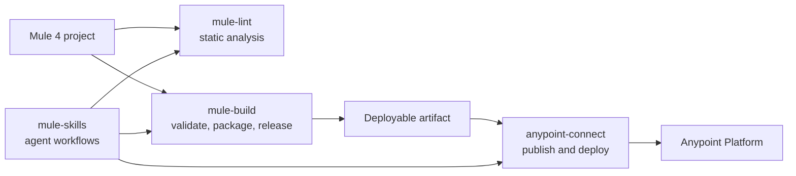

# Ecosystem

`mule-build` is independently versioned. The canonical package matrix, supported combination,
credentials, and end-to-end setup live in the
[mule-skills ecosystem hub](https://avinava.github.io/mule-skills/ecosystem/).

This page documents only the `mule-build` boundary so the compatibility table is not copied across
repositories.

## Where the boundaries are

`mule-build` stops at the artifact. It packages, validates, and versions locally, and it never talks to
Anypoint Platform — deploying a built JAR, reading runtime logs, or rolling back a release is
`anypoint-connect` territory, and that is why only that tool needs credentials.

## A note on the name

The `mule-build` skill in `mule-skills` and this `mule-build` MCP server share a name but are different
things. The skill is a workflow that tells an agent how to validate, package, and release; this server
provides the tools it calls. Either works without the other.

If you install [`mule-skills`](https://avinava.github.io/mule-skills/), this server comes preconfigured
with a pinned version, so there is nothing to set up twice.
