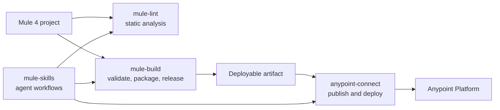

# Ecosystem

`mule-build` is independently versioned. The canonical package matrix, supported combination,
credentials, and end-to-end setup live in the
[mule-skills ecosystem hub](https://avinava.github.io/mule-skills/ecosystem/).

This page documents only the `mule-build` boundary so the compatibility table is not copied across
repositories.

## Where the boundaries are

`mule-build` stops at the artifact. It packages, validates, and versions locally, and it never talks to
Anypoint Platform — deploying a built JAR, reading runtime logs, or rolling back a release is
`anypoint-connect` territory, and that is why only that tool needs credentials.

```mermaid
flowchart LR
    Source["Mule 4 project"] --> Lint["mule-lint<br/>static analysis"]
    Source --> Build["mule-build<br/>validate, package, release"]
    Build --> Artifact["Deployable artifact"]
    Artifact --> Connect["anypoint-connect<br/>publish and deploy"]
    Connect --> Platform["Anypoint Platform"]
    Skills["mule-skills<br/>agent workflows"] --> Lint
    Skills --> Build
    Skills --> Connect
```

## A note on the name

The `mule-build` skill in `mule-skills` and this `mule-build` MCP server share a name but are different
things. The skill is a workflow that tells an agent how to validate, package, and release; this server
provides the tools it calls. Either works without the other.

If you install [`mule-skills`](https://avinava.github.io/mule-skills/), this server comes preconfigured
with a pinned version, so there is nothing to set up twice.

## Release and documentation coordination

Package releases remain explicit version-tag releases. Keep `package.json`, both lockfile root
versions, the newest versioned changelog entry, and any versioned examples in agreement. Run
`node scripts/check-release.mjs` before preparing a release; the tag workflow additionally requires
an exact `vX.Y.Z` match and passes the repository checks, dependency audit, and strict documentation
build before publishing. Changes under `Unreleased` do not update a published package automatically.

Choose the next semantic version after reviewing public contract changes. Merge the reviewed version
commit before pushing only its new tag; never move an existing release tag. The compatibility hub
keeps its existing published pins until the new package is available and its compatibility checks pass.
A missing dispatch token requires a manual hub update and does not undo a successful publication.

The documentation site follows the default branch independently of npm releases. Its Pages workflow
builds with `mkdocs build --strict`; manual publication also requires the default branch. A passing
pull-request build validates the proposed docs without publishing them. Tag publication, Pages
deployment, and a hub pin update remain separate operations.
