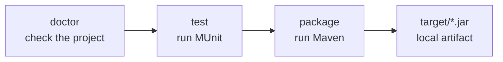

<div class="hero" markdown>

{ width="520" }

# Build your Mule application without learning Node.js

`mule-build` gives MuleSoft developers one repeatable path from project checks to a tested JAR.
Node.js only starts the command. Your project remains a normal Mule 4 Maven project.

[Install and build](getting-started.md){ .md-button .md-button--primary }
[Use with an AI agent](agent-setup.md){ .md-button }

</div>

<div class="path-grid" markdown>

<div class="path-card" markdown>

### MuleSoft developer

Install once, run `doctor`, then test and package the project you already open in Anypoint Studio.

[Start here](getting-started.md)

</div>

<div class="path-card" markdown>

### MUnit and CI

Run the whole suite or one focused test. Package only after the same checks pass locally and in CI.

[Use a recipe](recipes.md)

</div>

<div class="path-card" markdown>

### Coding agent

Give Codex, Claude, Copilot, Gemini, or Cursor a guarded runbook instead of asking it to guess build
commands.

[Copy the agent instruction](agent-setup.md)

</div>

</div>

## The normal path



```bash
npm install --global @sfdxy/mule-build@2.3.0
cd my-mule-application
mule-build doctor --operation test
mule-build test
mule-build package
```

```text
✓ Package built successfully
  Artifact: .../target/my-mule-application-1.0.0-2026-08-26T09-30-00.jar
  Tests: 12 run, 0 failed, 0 skipped
  Duration: 18.4s
  Maven warnings: 0
```

The result is a local Mule application JAR. Publishing and deployment are separate Anypoint tasks;
see the [ecosystem boundary](ecosystem.md).

## Know what can write

| Operation | Reads | Writes |
| --- | --- | --- |
| `doctor`, `enforce`, release `--dry-run` | project and environment | nothing |
| `test` | project | Maven test output under `target/` |
| `package` | project | build output under `target/` |
| `package --strip-secure` | project | temporary copy and `target/`; source stays unchanged |
| direct `strip` | Mule XML | source XML unless `--dry-run` |
| direct `release` | POM and Git state | POM, artifact, commit, tag, and possibly remote unless `--dry-run` |
| `run`, `stop` | project and runtime | local runtime state |

If something fails, `doctor` now prints the next action beneath the failed check. Start there before
reading a Maven stack trace.
